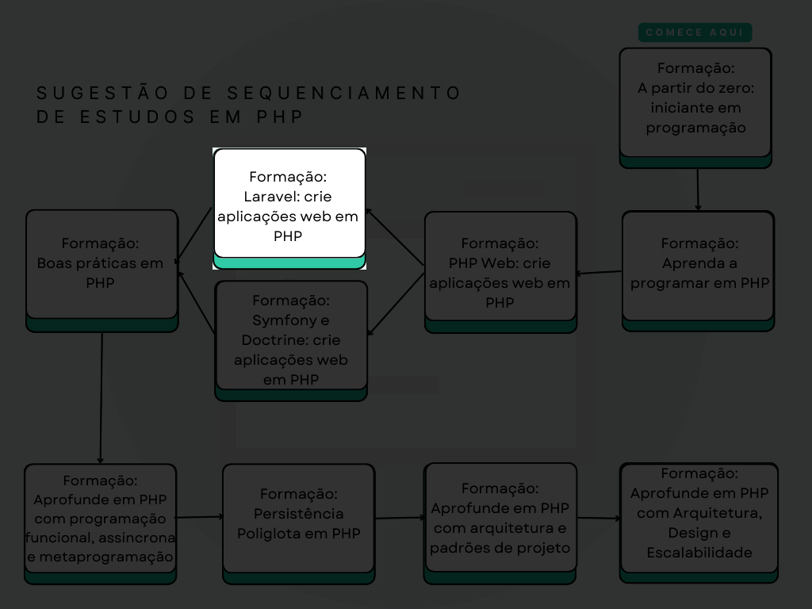

<a id="php-laravel"></a>

<!-- 
    Logo image generated by Bing IA: https://www.bing.com/images/create/
    Prompt: um elefante azul, simbolo da linguagem de programacao PHP, sentado em uma poltrona e segurando um controle remoto em frente a uma TV. Estilo cartoon, fundo branco para facil remocao, cores chapadas
-->
[](#php-laravel)

<!-- 
    icons by:
    https://devicon.dev/
    https://simpleicons.org/
-->
[](https://www.php.net) [](https://getcomposer.org/) [](https://laravel.com/) [](https://dev.w3.org/html5/spec-LC/) [](https://www.w3.org/Style/CSS/Overview.en.html) [](https://developer.mozilla.org/en-US/docs/Web/JavaScript)  [](https://www.sqlite.org/index.html) [](https://ubuntu.com/) [](https://github.com/jtonynet) [](https://code.visualstudio.com/) 


 <!---->

---

## 🕸️ Encontre-me na Web

[](https://www.linkedin.com/in/jos%C3%A9-r-99896a39/) [](https://dev.to/learningenuity) [](mailto:learningenuity@gmail.com) [](https://twitter.com/learningenuity) [](https://www.instagram.com/learningenuity) 

---

## 📁 O Projeto

<a id="index"></a>
### ⤴️ Index

__[Laravel CRUD Series](#php-laravel)__<br/>
  1. ⤴️ [Index](#index)
  2. 📗 [Sobre](#about)
  3. 💻 [Rodando o Projeto](#run)
  4. 🔢 [Versões](#versions)
  5. 🤖 [Use de AI](#ia)
  6. 🏁 [Conclusão](#conclusion)
 
<br/>

---

<a id="about"></a>
### 📗 Sobre

Projeto para atualização de conhecimentos em novas versões do framework Laravel, baseado no curso [Formação Laravel](https://cursos.alura.com.br/formacao-laravel) da Alura, com finalidade puramente didática.



<br/>

[⤴️ de volta ao Index](#index)

---

<a id="run"></a>
### 💻 Rodando o Projeto

**TODO**

<br/>

[⤴️ de volta ao Index](#index)

---

<a id="versions"></a>
### 🔢 Versões

As tags de versões estão sendo criadas manualmente a medida que o curso avança. Cada módulo é desenvolvido em uma branch a parte (Branch Based, [feature branch](https://www.atlassian.com/git/tutorials/comparing-workflows/feature-branch-workflow)) quando finalizadas é gerada tag e mergeadas em main.

Para obter mais informações, consulte o [Histórico de Versões](./CHANGELOG.md).

<br/>

[⤴️ de volta ao Index](#index)

---

<a id="ia"></a>
### 🤖 Uso de AI

As figuras do cabeçalho nesta página foram criadas com a ajuda de inteligência artificial e um mínimo de retoques e construção no Gimp [](https://www.gimp.org/)


__Os seguintes prompts foram usados para criação no  [Bing IA:](https://www.bing.com/images/create/)__


<details>
  <summary><b>Elefante Cartoon</b></summary>
"um elefante azul, simbolo da linguagem de programacao PHP, sentado em uma poltrona e segurando um controle remoto em frente a uma TV. Estilo cartoon, fundo branco para facil remocao, cores chapadas"<b>(sic)</b>
</details>

<br/>

A IA também ajudou em algumas pesquisas neste estudo, sendo utilizada como uma ferramenta de apoio; no entanto, __arte e desenvolvimento são, acima de tudo, atividades criativas humanas. Valorize as pessoas!__

Contrate artistas para projetos comerciais ou mais elaborados e aprenda a ser engenhoso!

<br/>

[⤴️ de volta ao Index](#index)

---

<a id="conclusion"></a>
### 🏁 Conclusão

Durante este estudo, meu objetivo foi me atualizar nas novas versões do framework Laravel, com foco nas versões 10 e 11, onde identifiquei algumas incompatibilidades e em alguns dos recursos mais recentes do PHP.

Acredito que há espaço para melhorias futuras, as quais pretendo implementar em breve ou incentivar outros estudos:

- Utilização do [Vite](https://vitejs.dev/) ou de uma solução melhor para dependências de front-end, em vez do depreciado `Mix`. No entanto, prefiro uma abordagem mais voltada para `APIs` que sejam consumidas por diversos clientes de front-end (React, Angular, Flutter, etc...).

- Utilização do [Laravel Breeze](https://laravel.com/docs/9.x/starter-kits#laravel-breeze) para gerenciar a autenticação de usuários, substituindo o middleware customizado utilizado nesta aplicação, o qual foi construído com propósito didático.

Essas melhorias não apenas otimizariam o desempenho, mas também alinhariam o projeto com as melhores práticas recomendadas pelo Laravel.

<br/>

[⤴️ de volta ao Index](#index)

<!-- 
COMANDOS:
(Levar para Wiki/Confluence/Obsidian comum)

```
> composer create-project laravel/laravel application_download
# Movi o conteudo para a raiz do projeto

> php artisan serve
> php artisan make:controller SeriesController --resource
```

```
npm install
npm install laravel-mix --save-dev
npm run mix
npm install bootstrap
npm run mix
#rodando o mix, ver tag 0.0.2
```

Criando migrations:
```
php artisan make:migration create_series_table
php artisan migrate
```

Criando Model
```
php artisan make:model Serie
```

Criando Request
```
php artisan make:request SeriesFormRequest
```

Criando Models com migration
```
php artisan make:model Season -m
php artisan make:model Episode -m
```

Executando migrations apos edicao dos arquivos de migrate:
```
php artisan migrate
```

debug bar:
```
composer require barryvdh/laravel-debugbar --dev
```
como visto em: https://github.com/barryvdh/laravel-debugbar

```
php artisan make:controller SeasonsController
```


Criando um serviceProvider de SeriesRepository para informar qual valor default o service container deve assumir quando essa interface for injetada e nao uma classe concreta Inversao de Dependencia
```
php artisan make::provider SeriesRepositoryProvider
```
verificar bootstrap\providers.php

Criando nova migration
 ```
 php artisan make:migration --table=episodes

 ┌ What should the migration be named? ─────────────────────────┐
 │ episodes_add_watched_episodes                                │
 └──────────────────────────────────────────────────────────────┘

 ```


 Criando middleware de autenticacao customizado (provavelmente pratica ruim, seguindo ela por finalidade didatica)
 ```
 php artisan make:middleware Autenticador
 ```

 - [Adicionar validacao assim q possivel](https://laravel.com/docs/9.x/validation#rule-confirmed)
 - [Laravel Breeze Lesson](https://cursos.alura.com.br/course/laravel-transacoes-service-container-autenticacao/task/105915)
-->